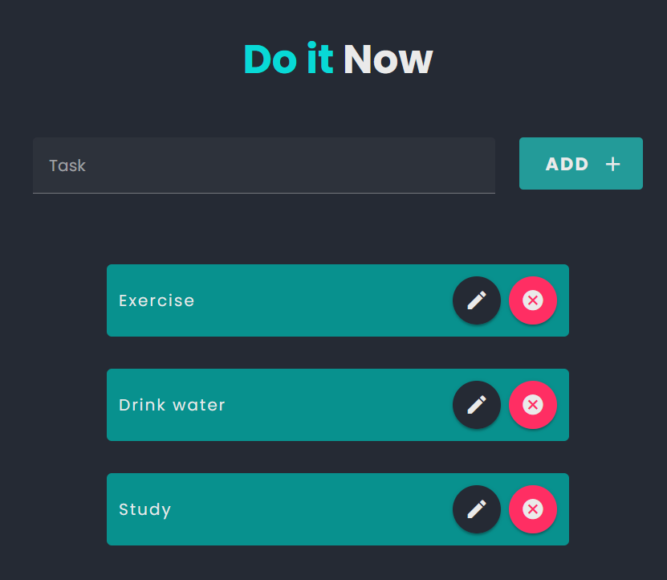
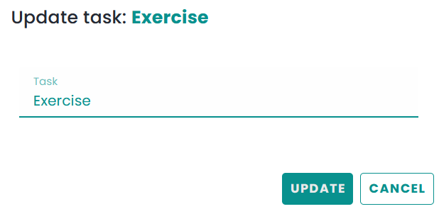

# Do it Now
A task management application that allows users to create, edit, and delete tasks. 

## Goal 
The goal of this project is to create a robust and versatile task management application using `Vue.js` and `PHP` with `MySQL` database, to help users manage their tasks efficiently and display them in a visually appealing manner.

## Docs
For detailed documentation, please refer to the [docs](./docs) directory.
- [Front-end](./docs/frontend.md)
- [Back-end](./docs/backend.md)
- [API](./docs/api.md)

## Quick Start
1. Clone the repository
```
git clone https://github.com/Sufferal/do-it-now.git
```
2. Install front-end dependencies inside `frontend/do-it-now` directory
``` 
npm install
```
3. Start `Apacke` and `MySQL` services in `XAMPP`
4. Start the front-end server
```
npm run dev
```
5. Open the browser and navigate to [http://localhost:5173](http://localhost:5173)

## Usage
### Add a new task


### Edit a task


### Delete a task
